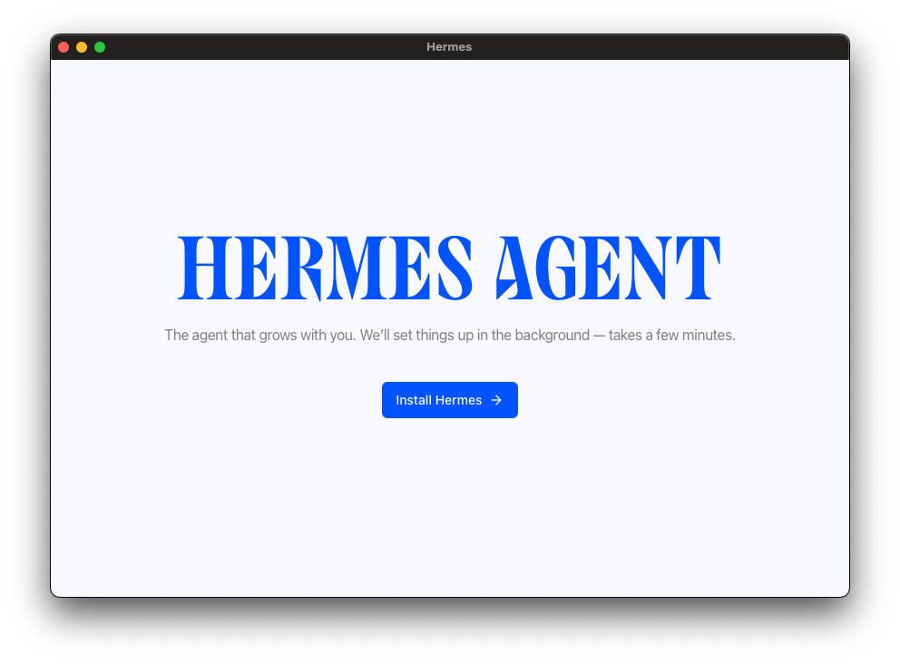
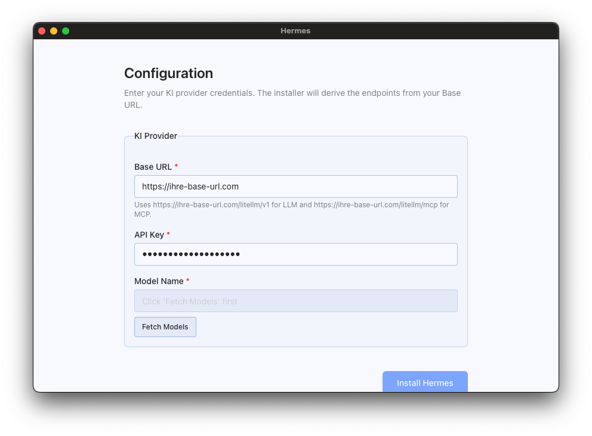
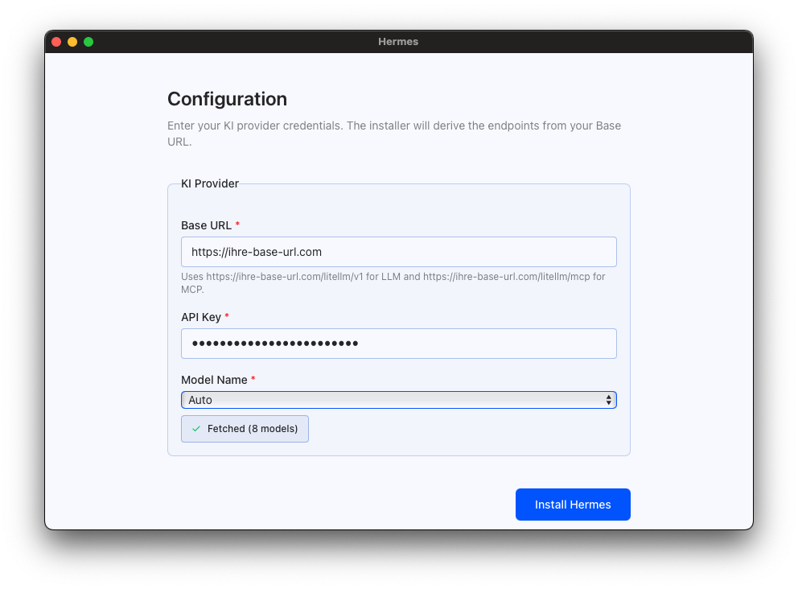
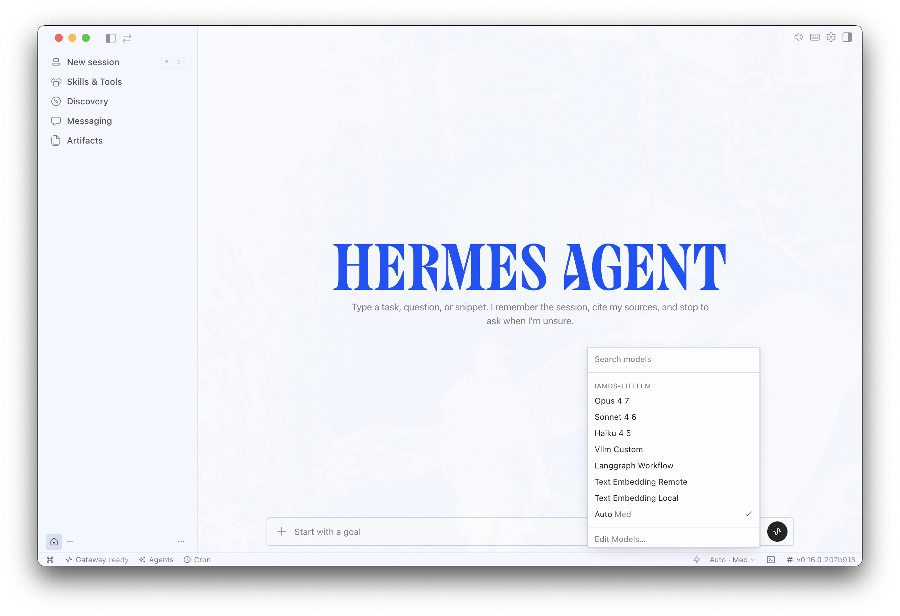
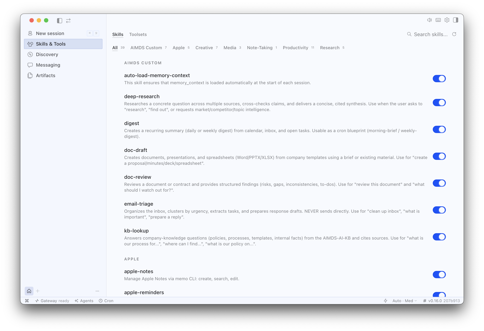
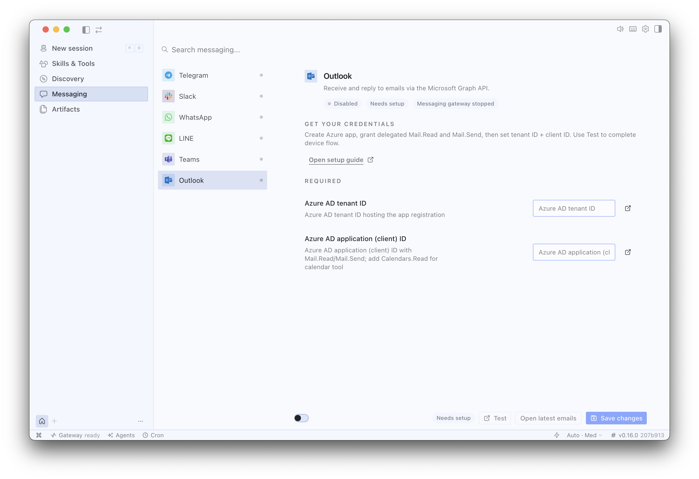

<p align="center">
  
</p>

# Hermes Agent ☤
<p align="center">
  <a href="https://github.com/IAMDS-GMBH/hermes-agent/blob/main/LICENSE"></a>
</p>

**The self-improving AI agent built by [Nous Research](https://nousresearch.com).** It's the only agent with a built-in learning loop — it creates skills from experience, improves them during use, nudges itself to persist knowledge, searches its own past conversations, and builds a deepening model of who you are across sessions. Run it on a $5 VPS, a GPU cluster, or serverless infrastructure that costs nearly nothing when idle. It's not tied to your laptop — talk to it from Telegram while it works on a cloud VM.

Use any model you want — [Nous Portal](https://portal.nousresearch.com), [OpenRouter](https://openrouter.ai) (200+ models), [NovitaAI](https://novita.ai) (AI-native cloud for Model API, Agent Sandbox, and GPU Cloud), [NVIDIA NIM](https://build.nvidia.com) (Nemotron), [Xiaomi MiMo](https://platform.xiaomimimo.com), [z.ai/GLM](https://z.ai), [Kimi/Moonshot](https://platform.moonshot.ai), [MiniMax](https://www.minimax.io), [Hugging Face](https://huggingface.co), OpenAI, or your own endpoint. Switch with `hermes model` — no code changes, no lock-in.

<table>
<tr><td><b>A real terminal interface</b></td><td>Full TUI with multiline editing, slash-command autocomplete, conversation history, interrupt-and-redirect, and streaming tool output.</td></tr>
<tr><td><b>Lives where you do</b></td><td>Telegram, Discord, Slack, WhatsApp, Signal, and CLI — all from a single gateway process. Voice memo transcription, cross-platform conversation continuity.</td></tr>
<tr><td><b>A closed learning loop</b></td><td>Agent-curated memory with periodic nudges. Autonomous skill creation after complex tasks. Skills self-improve during use. FTS5 session search with LLM summarization for cross-session recall. <a href="https://github.com/plastic-labs/honcho">Honcho</a> dialectic user modeling. Compatible with the <a href="https://agentskills.io">agentskills.io</a> open standard.</td></tr>
<tr><td><b>Scheduled automations</b></td><td>Built-in cron scheduler with delivery to any platform. Daily reports, nightly backups, weekly audits — all in natural language, running unattended.</td></tr>
<tr><td><b>Delegates and parallelizes</b></td><td>Spawn isolated subagents for parallel workstreams. Write Python scripts that call tools via RPC, collapsing multi-step pipelines into zero-context-cost turns.</td></tr>
<tr><td><b>Runs anywhere, not just your laptop</b></td><td>Six terminal backends — local, Docker, SSH, Singularity, Modal, and Daytona. Daytona and Modal offer serverless persistence — your agent's environment hibernates when idle and wakes on demand, costing nearly nothing between sessions. Run it on a $5 VPS or a GPU cluster.</td></tr>
<tr><td><b>Research-ready</b></td><td>Batch trajectory generation, trajectory compression for training the next generation of tool-calling models.</td></tr>
</table>

---

## Install

Download the **Hermes installer** (`.dmg` on macOS, `.exe` on Windows) from the link provided by your IAMDS contact.

**1. Welcome screen** — click **Install Hermes** to begin. The installer sets everything up in the background.

<p align="center">
  
</p>

**2. Configuration** — enter your **Base URL** and **API Key** (provided by your IAMDS administrator), then click **Fetch Models** to load the available models.

<p align="center">
  
</p>

**3. Select model and install** — choose a model from the dropdown (or leave it on **Auto**), then click **Install Hermes** to complete the setup.

<p align="center">
  
</p>

The installer handles everything automatically: Python environment, Node.js, dependencies, and the desktop app.

---

## Getting Started

```bash
hermes              # Interactive CLI — start a conversation
hermes model        # Choose your LLM provider and model
hermes tools        # Configure which tools are enabled
hermes config set   # Set individual config values
hermes gateway      # Start the messaging gateway (Telegram, Discord, etc.)
hermes setup        # Run the full setup wizard (configures everything at once)
hermes update       # Update to the latest version
hermes doctor       # Diagnose any issues
```

---

## Desktop App

### Changing the model

Click the model name in the bottom-right status bar to open the model selector. Choose from the available models provided by your IAMDS instance, then close the dropdown — the change takes effect immediately.

<p align="center">
  
</p>

---

### Skills & Tools

Open **Skills & Tools** in the left sidebar to enable or disable individual skills. Skills are grouped by category. Toggle the switch on the right of each skill to activate or deactivate it.

<p align="center">
  
</p>

#### Available skills

**AIMDS Custom**

| Skill | Description |
|---|---|
| `deep-research` | Researches a question across multiple sources, cross-checks claims, and delivers a concise, cited synthesis. Triggered by "research", "find out", or market/competitor intelligence requests. |
| `digest` | Creates a recurring daily or weekly summary from calendar, inbox, and open tasks. Usable as a cron blueprint (morning-brief / weekly-digest). |
| `doc-draft` | Creates documents, presentations, and spreadsheets (Word/PPTX/XLSX) from company templates. Use for "create a proposal/minutes/deck/spreadsheet". |
| `doc-review` | Reviews a document or contract and provides structured findings (risks, gaps, inconsistencies, to-dos). |
| `email-triage` | Organises the inbox, clusters by urgency, extracts tasks, and prepares response drafts. Never sends directly. Use for "clean up inbox", "what is important", "prepare a reply". |
| `kb-lookup` | Answers company-knowledge questions (policies, processes, templates) from the AIMDS knowledge base with cited sources. |

**Apple**

| Skill | Description |
|---|---|
| `apple-notes` | Manage Apple Notes: create, search, edit. |
| `apple-reminders` | Apple Reminders: add, list, complete. |
| `findmy` | Track Apple devices/AirTags via FindMy.app on macOS. |
| `imessage` | Send and receive iMessages/SMS on macOS. |
| `macos-computer-use` | Drive the macOS desktop: screenshots, mouse, keyboard. |

**Creative**

| Skill | Description |
|---|---|
| `architecture-diagram` | Dark-themed SVG architecture/cloud/infra diagrams as HTML. |
| `ascii-art` | ASCII art via pyfiglet, cowsay, boxes, image-to-ascii. |
| `claude-design` | Design one-off HTML artifacts (landing pages, decks, prototypes). |
| `excalidraw` | Hand-drawn Excalidraw JSON diagrams (architecture, flow, sequence). |
| `humanizer` | Humanize text: strip AI-isms and add real voice. |
| `manim-video` | Manim CE animations (3Blue1Brown-style math/algo videos). |
| `p5js` | p5.js sketches: generative art, shaders, interactive, 3D. |
| `sketch` | Throwaway HTML mockups: 2–3 design variants to compare. |
| `songwriting-and-ai-music` | Songwriting craft and Suno AI music prompts. |

**Media**

| Skill | Description |
|---|---|
| `gif-search` | Search/download GIFs from Tenor. |
| `youtube-content` | Convert YouTube transcripts to summaries, threads, blog posts. |
| `songsee` | Audio spectrograms and features (mel, chroma, MFCC). |

**Note-Taking**

| Skill | Description |
|---|---|
| `obsidian` | Read, search, create, and edit notes in an Obsidian vault. |

**Productivity**

| Skill | Description |
|---|---|
| `airtable` | Airtable REST API: records CRUD, filters, upserts. |
| `google-workspace` | Gmail, Calendar, Drive, Docs, Sheets. |
| `maps` | Geocode, POIs, routes, timezones via OpenStreetMap/OSRM. |
| `nano-pdf` | Edit PDF text, typos, and titles via natural language. |
| `notion` | Notion API: pages, databases, markdown. |
| `ocr-and-documents` | Extract text from PDFs and scanned documents. |
| `powerpoint` | Create, read, and edit .pptx decks, slides, and notes. |
| `teams-meeting-pipeline` | Summarise Teams meetings, inspect pipeline status, manage Graph subscriptions. |

**Research**

| Skill | Description |
|---|---|
| `arxiv` | Search arXiv papers by keyword, author, category, or ID. |
| `blogwatcher` | Monitor blogs and RSS/Atom feeds. |
| `llm-wiki` | Build and query an interlinked markdown knowledge base. |
| `polymarket` | Query Polymarket: markets, prices, orderbooks, history. |
| `research-paper-writing` | Write ML papers for NeurIPS/ICML/ICLR. |

---

### Messaging — Outlook

Open **Messaging** in the left sidebar and select **Outlook** to configure the Microsoft Outlook integration. Enter your **Azure AD Tenant ID** and **Application (Client) ID**, then use the **Test** button to complete device flow authentication.

<p align="center">
  
</p>

For full setup instructions including Azure app registration, required permissions, and admin consent steps, see [docs/messaging/outlook-setup.md](docs/messaging/outlook-setup.md).

---

## CLI vs Messaging Quick Reference

Hermes has two entry points: start the terminal UI with `hermes`, or run the gateway and talk to it from Telegram, Discord, Slack, WhatsApp, or Outlook. Once you're in a conversation, many slash commands are shared across both interfaces.

| Action                         | CLI                                           | Messaging platforms                                                              |
| ------------------------------ | --------------------------------------------- | -------------------------------------------------------------------------------- |
| Start chatting                 | `hermes`                                      | Run `hermes gateway setup` + `hermes gateway start`, then send the bot a message |
| Start fresh conversation       | `/new` or `/reset`                            | `/new` or `/reset`                                                               |
| Change model                   | `/model [provider:model]`                     | `/model [provider:model]`                                                        |
| Set a personality              | `/personality [name]`                         | `/personality [name]`                                                            |
| Retry or undo the last turn    | `/retry`, `/undo`                             | `/retry`, `/undo`                                                                |
| Compress context / check usage | `/compress`, `/usage`, `/insights [--days N]` | `/compress`, `/usage`, `/insights [days]`                                        |
| Browse skills                  | `/skills` or `/<skill-name>`                  | `/<skill-name>`                                                                  |
| Interrupt current work         | `Ctrl+C` or send a new message                | `/stop` or send a new message                                                    |
| Platform-specific status       | `/platforms`                                  | `/status`, `/sethome`                                                            |

---

## License

MIT — see [LICENSE](LICENSE).

Built by [Nous Research](https://nousresearch.com).
